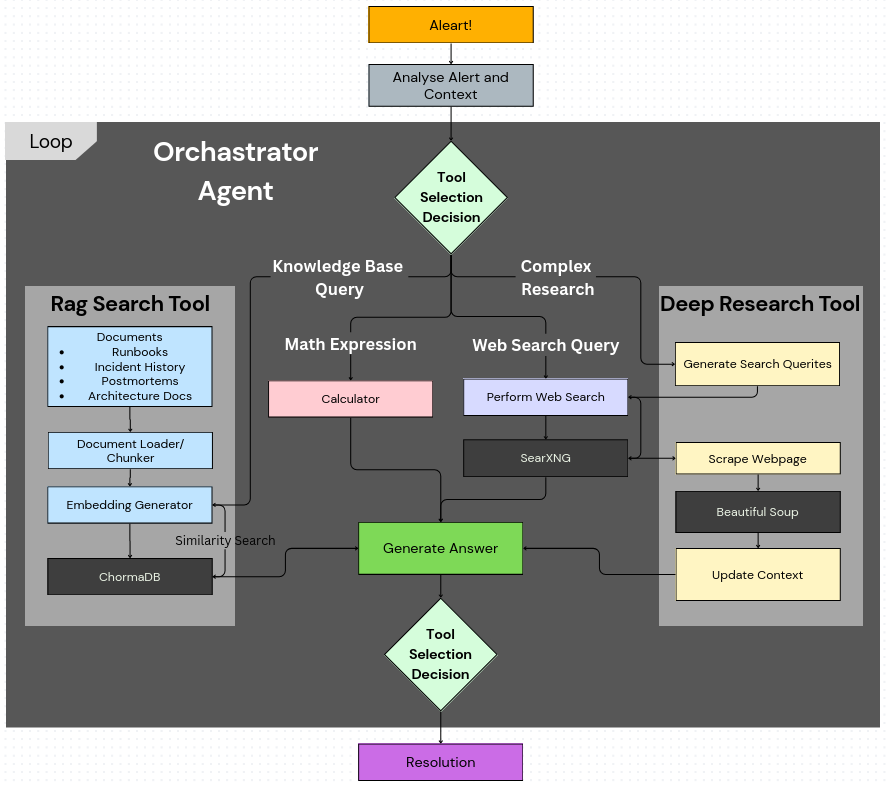

# SRE Alert Investigation Agent

An intelligent Site Reliability Engineering (SRE) orchestration agent that analyzes system alerts and automatically selects the most appropriate investigation tool to gather relevant context and information for incident response.

## Overview

This SRE agent acts as an intelligent orchestrator that receives system alerts and their context, then decides which investigation tool will provide the most valuable information for understanding and resolving the incident. The agent can leverage internal knowledge bases, external web searches, or perform calculations to support incident response.



## Features

- **Intelligent Tool Selection**: Automatically chooses between RAG search, web search, deep research, or calculator tools based on alert analysis
- **RAG-Powered Knowledge Base**: Searches internal SRE documentation, (add documents to `./knowledge_base_sre`)
- **External Information Retrieval**: Uses SearxNG to search for error alerts
- **Deep Research Capabilities**: Multi-step research tool that generates search queries, scrapes content, and provides comprehensive analysis with follow-up questions
- **Metric Calculations**: Performs calculations
- **Rich Alert Context Processing**: Handles complex system alerts with detailed contextual information

## Alert Investigation Capabilities

The agent is a POC and might need specialization depending on types of system alerts.

## Tools

### RAG Search Tool
- **Purpose**: Query internal SRE knowledge bases and documentation
- **Use Cases**: 
  - Finding runbooks for specific services or error patterns
  - Retrieving incident histories and post-mortems
  - Accessing architectural diagrams and service dependencies
  - Looking up internal troubleshooting procedures
- **Knowledge Base Location**: [`knowledge_base_sre/`](knowledge_base_sre/)

### SearxNG Search Tool
- **Purpose**: Search external sources for technical information
- **Use Cases**:
  - Looking up specific error codes and their meanings
  - Finding CVE information and security advisories
  - Searching for third-party software documentation
  - Checking external service status pages
  - Finding community troubleshooting guides

### Deep Research Tool
- **Purpose**: Perform comprehensive, multi-step research on complex topics by combining web search, content scraping, and AI analysis
- **Use Cases**:
  - Investigating complex system issues that require multiple information sources
  - Researching new technologies, vulnerabilities, or best practices
  - Gathering comprehensive context for incident analysis
  - Following up on initial findings with deeper investigation
  - Analyzing trends and patterns across multiple sources

**Key Features**:
- **Intelligent Query Generation**: Automatically generates multiple relevant search queries from a research topic
- **Multi-Source Content Scraping**: Scrapes and analyzes content from multiple web sources
- **Context-Aware Research**: Determines whether new searches are needed based on existing context
- **Comprehensive Analysis**: Provides detailed answers with follow-up questions for further investigation
- **Source Tracking**: Maintains references to all sources used in the research

**Interactive Mode**: The tool includes an interactive research session mode for exploratory investigation.

### Calculator Tool
- **Purpose**: Perform mathematical calculations for SRE metrics
- **Use Cases**:
  - Error budget consumption calculations
  - Performance impact analysis (e.g., latency increase factors)
  - Capacity planning calculations
  - SLO/SLI threshold evaluations

## Getting Started

### Prerequisites

- Python 3.8+
- OpenAI API key
- Docker (for SearxNG)

### Installation

1. Clone the repository:
   ```bash
   git clone <repository-url>
   cd agent_sre
   ```

2. Install dependencies using Poetry:
   ```bash
   poetry install
   ```
   
   Or with pip:
   ```bash
   pip install -e .
   ```

3. Set up environment variables:
   Create a `.env` file in the project root:
   ```env
   OPENAI_API_KEY=your_openai_api_key
   ```

### SearxNG Setup

SearxNG provides privacy-respecting web search capabilities for the agent.

1. Install and run SearxNG using Docker:
   ```bash
   # Clone SearxNG repository
   git clone https://github.com/searxng/searxng.git
   cd searxng
   
   # Start SearxNG
   docker compose up -d
   ```

2. Verify SearxNG is running:
   - Open http://localhost:8080 in your browser
   - You should see the SearxNG search interface

3. To stop SearxNG:
   ```bash
   docker compose down
   ```

**Note**: The agent is configured to use SearxNG at `http://localhost:8080` by default. Update the configuration in [`orchestration_agent/orchestrator.py`](orchestration_agent/orchestrator.py) if using a different URL.

### Knowledge Base Setup

The RAG search tool uses documents stored in the [`knowledge_base_sre/`](knowledge_base_sre/) directory.

#### Directory Structure
```
knowledge_base_sre/
├── sre_handbook.md          # SRE best practices and procedures
├── incident_response.txt    # Incident response procedures
├── sre_incidents.json       # Historical incident data
└── processed_sre_documents.json  # Processed document metadata
```

#### Adding Your SRE Documentation

1. **Place your SRE documents** in the [`knowledge_base_sre/`](knowledge_base_sre/) directory:
   - Runbooks (Markdown, text files)
   - Post-mortem reports
   - Architecture documentation
   - Service dependency maps
   - Troubleshooting guides
   - Historical incident reports

2. **Supported file formats**:
   - Markdown (`.md`)
   - Text files (`.txt`)
   - JSON files (`.json`)

3. **Document processing**: The agent automatically processes and indexes documents when started. The processed embeddings are stored in a ChromaDB collection for fast retrieval.

4. **Updating the knowledge base**: 
   - Add new documents to the directory
   - Set `recreate_collection_on_init=True` in the RAG tool configuration to reindex
   - Or delete the `sre_chroma_db` directory to force reindexing

### Running the Agent

Execute the orchestration agent:
```bash
python orchestration_agent/orchestrator.py
```

The agent will process several example alerts and demonstrate tool selection for each scenario.

### Running Tools Standalone

#### Deep Research Tool
For interactive research sessions:
```bash
python orchestration_agent/tools/deep_research/interactive.py
```

This launches an interactive research session where you can ask research questions and get comprehensive answers with sources and follow-up questions.

#### RAG Search Tool
For interactive knowledge base queries:
```bash
python orchestration_agent/tools/rag_search/interactive.py
```

This launches an interactive RAG search session where you can query your SRE knowledge base and get detailed answers with document sources.

## Configuration

### Agent Configuration

Key configuration options in [`orchestration_agent/orchestrator.py`](orchestration_agent/orchestrator.py):

- **SearxNG URL**: Update `base_url` in `SearxNGSearchToolConfig`
- **Knowledge Base Path**: Modify `docs_dir` in `RAGSearchToolConfig`
- **LLM Model**: Change `model` in agent configuration

### RAG Tool Configuration

Located in [`orchestration_agent/tools/rag_search/config.py`](orchestration_agent/tools/rag_search/config.py):

- **Document Directory**: Path to SRE knowledge base
- **Embedding Model**: OpenAI embedding model for document indexing
- **Retrieval Settings**: Number of chunks to retrieve per query
- **ChromaDB Settings**: Persistence and collection configuration
- **Chunk Settings**: Adjust `chunk_size` and `chunk_overlap` for document processing
- **LLM Model**: Change `model` in agent configuration

### Deep Research Tool Configuration

Located in [`orchestration_agent/tools/deep_research/config.py`](orchestration_agent/tools/deep_research/config.py):

- **SearxNG Integration**: Uses the same SearxNG instance as the search tool
- **Search Results Limit**: Configurable maximum number of sources to scrape and analyze
- **LLM Model**: Uses GPT-4o-mini for query generation and analysis
- **Context Management**: Intelligent context providers for scraped content and current date

## Architecture

### Components

- **Orchestrator Agent**: Main decision-making agent that analyzes alerts and selects tools
- **Document Processor**: Handles knowledge base indexing and chunking
- **RAG Search Tool**: Retrieves relevant information from internal knowledge base
- **ChromaDB Service**: Vector database for document embeddings and similarity search
- **SearxNG Search Tool**: Searches external sources for technical information
- **Deep Research Tool**: Multi-step research tool combining query generation, web search, content scraping, and comprehensive analysis
- **Calculator Tool**: Performs SRE-related calculations

### Input/Output Schemas

- **[`OrchestratorInputSchema`](orchestration_agent/orchestrator.py:37)**: System alert and context information
- **[`OrchestratorOutputSchema`](orchestration_agent/orchestrator.py:44)**: Tool selection and parameters
- **Tool-specific schemas**: Input/output schemas for each investigation tool

### Context Providers

- **[`CurrentDateProvider`](orchestration_agent/context_providers.py)**: Provides current date context
- **[`RAGContextProvider`](orchestration_agent/context_providers.py)**: Manages retrieved document chunks

## Extending the Agent

### Adding New Tools

1. Create a new tool class inheriting from `BaseTool`
2. Define input/output schemas
3. Register the tool in the orchestrator configuration
4. Update the tool selection logic

### Customizing Alert Processing

1. Modify the system prompt in the orchestrator agent
2. Add new alert types to the input schema
3. Update tool selection criteria based on alert characteristics

### Enhancing Knowledge Base

1. Add domain-specific documents to [`knowledge_base_sre/`](knowledge_base_sre/)
2. Customize document processing for specific formats
3. Tune embedding and retrieval parameters for your use case

## Contributing

1. Fork the repository
2. Create a feature branch
3. Add tests for new functionality
4. Submit a pull request

## License

This project is licensed under the MIT License - see the LICENSE file for details.
