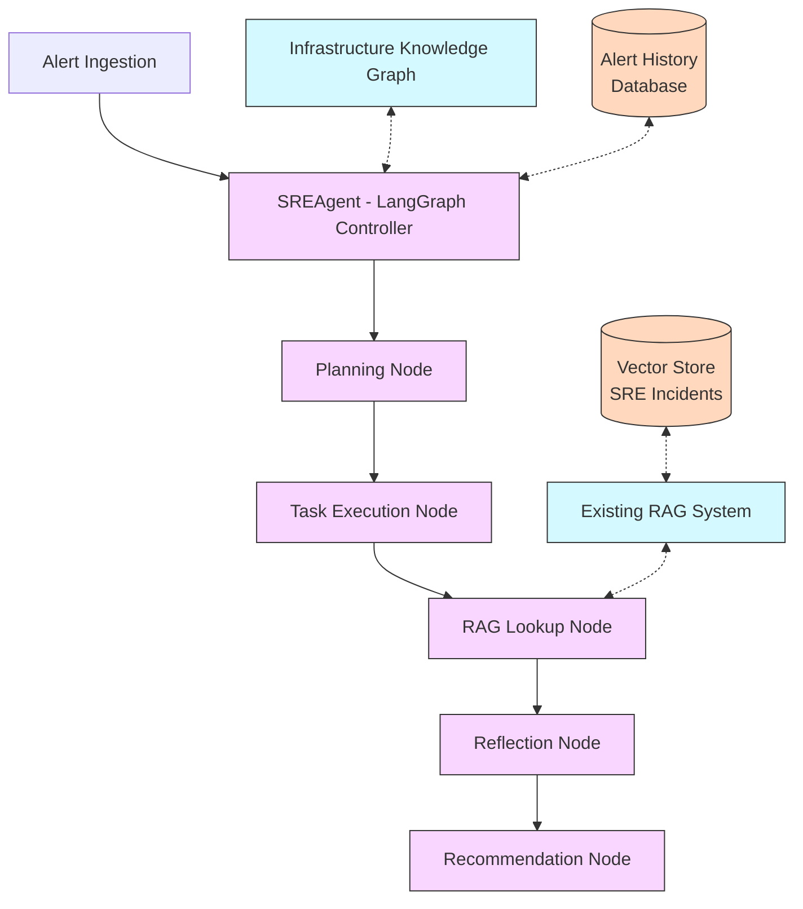

# SRE Agent Architecture - LangGraph Based Solution

## Overview

This document outlines the architecture for an SRE (Site Reliability Engineering) agent that processes alerts and recommends solutions using LangGraph. The agent leverages an existing RAG (Retrieval-Augmented Generation) system, integrates with an infrastructure knowledge graph, and follows a structured workflow for processing alerts.

## Requirements

1. **Alert Processing**: Handle incoming alerts with standardized structure:
   ```json
   {
     "id": "alert-001", 
     "type": "PodCrashLoop",
     "summary": "Pod auth-service-xyz-pod in cluster-alpha is in CrashLoopBackOff",
     "details": "The pod auth-service-xyz-pod has restarted 5 times in 15 minutes"
   }
   ```

2. **RAG Integration**: Leverage the existing RAG system in the `code-rag` repository.

3. **Workflow**: Follow a specific workflow:
   - Create a plan when an alert arrives
   - Execute tasks sequentially
   - First task checks similar alerts in vector store
   - After each task, reflect before moving to the next task
   - Final output includes recommended investigation area and solution

4. **Infrastructure Context**: Integrate with an infrastructure knowledge graph for context.

## High-Level Architecture



## Component Descriptions

### Core LangGraph Components

1. **SREAgentController**
   - The main entry point and orchestrator for the LangGraph workflow
   - Manages state throughout the alert processing lifecycle
   - Interfaces with external systems like the knowledge graph and RAG system
   - Built using LangGraph's StatefulGraph

2. **LangGraph Graph Nodes:**
   - **Planning Node**: Creates an initial plan when an alert arrives
   - **Task Execution Node**: Executes each task in the plan sequentially
   - **RAG Lookup Node**: Cross-references with similar alerts in vector store
   - **Reflection Node**: Analyzes task results and adjusts approach if needed
   - **Recommendation Node**: Generates final output with investigation areas and solutions

### Integration with Existing Code-RAG System

1. **RAGService Adapter**
   - Acts as a bridge between the LangGraph workflow and the existing CodeRAG system
   - Leverages existing `CodeRAG`, `Retriever`, and `ChromaVectorStore` classes
   - Extends functionality to query SRE incident collection with alert data

2. **InfrastructureGraphService**
   - Provides methods to traverse and extract relevant information from the infrastructure knowledge graph
   - Makes infrastructure data available as context to the LLM throughout the workflow

### Data Models

1. **AlertModel**
   - Represents the standardized alert structure

2. **WorkflowState**
   - Maintains the current state of the workflow
   - Tracks progress of task execution
   - Stores intermediate results and context

3. **RecommendationModel**
   - Structure for the final output from the agent
   - Contains investigation areas, solutions, and references to similar incidents

## Detailed Component Implementation

### SRE Agent LangGraph Implementation

```python
from typing import Dict, List, Optional, Any
from langgraph.graph import StateGraph, END
import code_rag

# Define our state type
class AgentState(TypedDict):
    alert: Dict[str, Any]
    plan: Optional[List[str]]
    current_task: Optional[str]
    completed_tasks: List[str]
    similar_incidents: List[Dict[str, Any]]
    reflections: List[str]
    recommendation: Optional[Dict[str, Any]]
    infra_context: Optional[Dict[str, Any]]

# Node implementations
def create_plan(state: AgentState) -> AgentState:
    """Create an initial response plan based on the alert"""
    # Implementation details here
    return new_state

def determine_next_task(state: AgentState) -> str:
    """Determine which task to execute next"""
    if not state["plan"] or len(state["completed_tasks"]) >= len(state["plan"]):
        return "generate_recommendation"
    
    next_task_idx = len(state["completed_tasks"])
    current_task = state["plan"][next_task_idx]
    
    if next_task_idx == 0:  # First task is always RAG lookup
        return "rag_lookup"
    
    return "execute_task"

def execute_task(state: AgentState) -> AgentState:
    """Execute the current task in the plan"""
    # Implementation details here
    return new_state

def rag_lookup(state: AgentState) -> AgentState:
    """Find similar incidents in the RAG system"""
    # Use the existing code_rag system to look up similar incidents
    # Implementation details here
    return new_state

def reflect(state: AgentState) -> AgentState:
    """Reflect on the results of the current task"""
    # Implementation details here
    return new_state

def generate_recommendation(state: AgentState) -> AgentState:
    """Generate final recommendations based on all gathered information"""
    # Implementation details here
    return new_state

# Create the graph
def create_agent_graph():
    workflow = StateGraph(AgentState)
    
    # Add nodes
    workflow.add_node("create_plan", create_plan)
    workflow.add_node("execute_task", execute_task)
    workflow.add_node("rag_lookup", rag_lookup)
    workflow.add_node("reflect", reflect)
    workflow.add_node("generate_recommendation", generate_recommendation)
    
    # Define edges
    workflow.add_edge("create_plan", determine_next_task)
    workflow.add_conditional_edges(
        "determine_next_task",
        {
            "rag_lookup": lambda state: state["current_task"] == "rag_lookup",
            "execute_task": lambda state: state["current_task"] == "execute_task",
            "generate_recommendation": lambda state: state["current_task"] == "generate_recommendation",
        }
    )
    workflow.add_edge("rag_lookup", "reflect")
    workflow.add_edge("execute_task", "reflect")
    workflow.add_edge("reflect", determine_next_task)
    workflow.add_edge("generate_recommendation", END)
    
    # Compile the graph
    return workflow.compile()
```

### RAG Integration Service

```python
class RAGService:
    """Service to integrate with the existing CodeRAG system"""
    
    def __init__(self, settings=None):
        """Initialize with optional custom settings"""
        from code_rag import CodeRAG
        from code_rag.config import get_settings
        
        self.settings = settings or get_settings()
        
        # Initialize with SRE incidents collection
        self.rag = CodeRAG(
            chroma_path=str(self.settings.chroma_path),
            embedding_model=self.settings.embedding_model,
            llm_model=self.settings.llm_model,
            openai_api_key=self.settings.openai_api_key,
            openrouter_api_key=self.settings.openrouter_api_key,
            settings=self.settings,
        )
        
        # Set to use SRE incidents collection
        self.rag.vector_store.collection_name = "sre_incidents"
    
    def find_similar_alerts(self, alert: Dict[str, Any], num_results: int = 3) -> List[Dict[str, Any]]:
        """Find similar past incidents for a given alert"""
        # Combine alert details to form a query
        query = f"{alert['type']}: {alert['summary']} - {alert['details']}"
        
        # Query the RAG system
        result = self.rag.query(
            error_message=query,
            num_results=num_results,
            temperature=0.2,  # Lower temperature for more focused results
        )
        
        return result.get("references", [])
```

### Infrastructure Graph Service

```python
class InfrastructureGraphService:
    """Service for interacting with the infrastructure knowledge graph"""
    
    def __init__(self, graph_data: Dict[str, Any]):
        """Initialize with the infrastructure graph data"""
        self.graph = graph_data
    
    def get_context_for_alert(self, alert: Dict[str, Any]) -> Dict[str, Any]:
        """Extract relevant infrastructure context for an alert"""
        # Parse alert to identify the affected components
        resource_type = None
        resource_name = None
        cluster_name = None
        
        # Example: Extract information from a pod crashloop alert
        if alert["type"] == "PodCrashLoop":
            resource_type = "pod"
            # Extract pod name and cluster from the summary
            import re
            pod_match = re.search(r"Pod\s+(\S+)\s+in\s+cluster-(\S+)", alert["summary"])
            if pod_match:
                resource_name = pod_match.group(1)
                cluster_name = f"cluster-{pod_match.group(2)}"
        
        # Navigate the graph to find the relevant context
        context = self._find_resource_context(resource_type, resource_name, cluster_name)
        return context
    
    def _find_resource_context(self, resource_type: str, resource_name: str, cluster_name: str) -> Dict[str, Any]:
        """Traverse the graph to find context for a specific resource"""
        # Implementation to navigate the nested infrastructure graph
        # This would contain logic to traverse the graph structure
        # and find the relevant portion (region, project, vpc, subnet, cluster)
        
        # Simplified example:
        for region in self.graph.get("regions", []):
            for project in region.get("projects", []):
                for vpc in project.get("vpcs", []):
                    for subnet in vpc.get("subnets", []):
                        for cluster in subnet.get("clusters", []):
                            if cluster.get("name") == cluster_name:
                                # We found the cluster, now extract the relevant context
                                return {
                                    "region": region.get("name"),
                                    "project": project.get("name"),
                                    "vpc_id": vpc.get("id"),
                                    "subnet_id": subnet.get("id"),
                                    "cluster": cluster,
                                }
        
        return {}
```

### Alert Processor

```python
class AlertProcessor:
    """Main entry point for processing alerts"""
    
    def __init__(self, infra_graph: Dict[str, Any]):
        """Initialize with the infrastructure graph"""
        self.infra_service = InfrastructureGraphService(infra_graph)
        self.rag_service = RAGService()
        self.agent_graph = create_agent_graph()
    
    async def process_alert(self, alert: Dict[str, Any]) -> Dict[str, Any]:
        """Process an incoming alert through the LangGraph workflow"""
        # Get infrastructure context for this alert
        infra_context = self.infra_service.get_context_for_alert(alert)
        
        # Initialize the state
        initial_state = {
            "alert": alert,
            "plan": None,
            "current_task": None,
            "completed_tasks": [],
            "similar_incidents": [],
            "reflections": [],
            "recommendation": None,
            "infra_context": infra_context
        }
        
        # Execute the workflow
        final_state = await self.agent_graph.arun(initial_state)
        
        return final_state["recommendation"]
```

## Implementation Guide for LangGraph Nodes

### Planning Node

```python
def create_plan(state: AgentState) -> AgentState:
    """Create an initial plan based on the alert"""
    from langchain.chat_models import ChatOpenAI
    from langchain.prompts import ChatPromptTemplate
    
    # Define the system prompt for plan creation
    template = """
    You are an expert SRE responsible for creating an investigation plan for alerts.
    
    ## ALERT INFORMATION
    Type: {alert_type}
    Summary: {alert_summary}
    Details: {alert_details}
    
    ## INFRASTRUCTURE CONTEXT
    {infra_context}
    
    Create a sequential investigation plan with 3-5 specific tasks to diagnose and resolve this alert.
    The first task should always be to check similar past incidents.
    Format your response as a numbered list of tasks only.
    """
    
    # Format the prompt with alert data
    prompt = ChatPromptTemplate.from_template(template)
    llm = ChatOpenAI(temperature=0.2)
    
    # Create the chain
    chain = prompt | llm
    
    # Execute the chain
    result = chain.invoke({
        "alert_type": state["alert"]["type"],
        "alert_summary": state["alert"]["summary"],
        "alert_details": state["alert"]["details"],
        "infra_context": str(state["infra_context"])
    })
    
    # Parse the tasks from the result
    tasks = []
    for line in result.content.strip().split("\n"):
        # Extract tasks from numbered list
        if line.strip() and line[0].isdigit() and '. ' in line:
            tasks.append(line.split('. ', 1)[1].strip())
    
    # Update the state
    return {
        **state,
        "plan": tasks
    }
```

### RAG Lookup Node

```python
def rag_lookup(state: AgentState) -> AgentState:
    """Find similar incidents in the RAG system"""
    # Get the RAG service
    rag_service = RAGService()
    
    # Find similar alerts
    similar_incidents = rag_service.find_similar_alerts(state["alert"])
    
    # Update the state
    new_state = {
        **state,
        "similar_incidents": similar_incidents,
        "completed_tasks": state["completed_tasks"] + ["Check similar past incidents"],
        "current_task": state["plan"][0] if state["plan"] else None
    }
    
    return new_state
```

### Task Execution Node

```python
def execute_task(state: AgentState) -> AgentState:
    """Execute the current task in the plan"""
    from langchain.chat_models import ChatOpenAI
    from langchain.prompts import ChatPromptTemplate
    
    # Get the current task
    current_task_idx = len(state["completed_tasks"])
    current_task = state["plan"][current_task_idx]
    
    # Define the task execution prompt
    template = """
    You are an expert SRE responsible for investigating alerts.
    
    ## ALERT INFORMATION
    Type: {alert_type}
    Summary: {alert_summary}
    Details: {alert_details}
    
    ## INFRASTRUCTURE CONTEXT
    {infra_context}
    
    ## SIMILAR PAST INCIDENTS
    {similar_incidents}
    
    ## CURRENT TASK
    {current_task}
    
    ## COMPLETED TASKS
    {completed_tasks}
    
    Execute the current task and provide detailed findings. Be specific about what you discovered.
    """
    
    # Format the prompt with data
    prompt = ChatPromptTemplate.from_template(template)
    llm = ChatOpenAI(temperature=0.3)
    
    # Create the chain
    chain = prompt | llm
    
    # Execute the chain
    similar_incidents_text = "\n".join([
        f"Incident: {incident['error']}\n"
        f"Resolution: {incident['solution']}\n"
        f"Similarity: {incident['similarity_score']:.2f}\n"
        for incident in state["similar_incidents"]
    ])
    
    completed_tasks_text = "\n".join([
        f"- {task}" for task in state["completed_tasks"]
    ])
    
    result = chain.invoke({
        "alert_type": state["alert"]["type"],
        "alert_summary": state["alert"]["summary"],
        "alert_details": state["alert"]["details"],
        "infra_context": str(state["infra_context"]),
        "similar_incidents": similar_incidents_text,
        "current_task": current_task,
        "completed_tasks": completed_tasks_text
    })
    
    # Update the state with the execution result
    task_result = result.content.strip()
    
    return {
        **state, 
        "task_results": state.get("task_results", []) + [task_result],
        "current_task": current_task
    }
```

### Reflection Node

```python
def reflect(state: AgentState) -> AgentState:
    """Reflect on the results of the current task"""
    from langchain.chat_models import ChatOpenAI
    from langchain.prompts import ChatPromptTemplate
    
    # Get the current task and its result
    current_task = state["current_task"]
    current_task_idx = len(state["completed_tasks"])
    task_result = state["task_results"][-1] if state.get("task_results") else ""
    
    # Define the reflection prompt
    template = """
    You are an expert SRE responsible for critical reflection on alert investigation.
    
    ## ALERT INFORMATION
    Type: {alert_type}
    Summary: {alert_summary}
    Details: {alert_details}
    
    ## CURRENT TASK
    {current_task}
    
    ## TASK RESULT
    {task_result}
    
    ## REFLECTION INSTRUCTIONS
    Analyze the task result and provide a concise reflection on:
    1. What was learned from this task
    2. How this information impacts the investigation
    3. Whether any adjustment is needed to the plan
    
    Make your reflection concise and actionable.
    """
    
    # Format the prompt with data
    prompt = ChatPromptTemplate.from_template(template)
    llm = ChatOpenAI(temperature=0.2)
    
    # Create the chain
    chain = prompt | llm
    
    # Execute the chain
    result = chain.invoke({
        "alert_type": state["alert"]["type"],
        "alert_summary": state["alert"]["summary"],
        "alert_details": state["alert"]["details"],
        "current_task": current_task,
        "task_result": task_result
    })
    
    reflection = result.content.strip()
    
    # Update the state
    return {
        **state,
        "reflections": state.get("reflections", []) + [reflection],
        "completed_tasks": state["completed_tasks"] + [current_task]
    }
```

### Recommendation Node

```python
def generate_recommendation(state: AgentState) -> AgentState:
    """Generate final recommendations based on all gathered information"""
    from langchain.chat_models import ChatOpenAI
    from langchain.prompts import ChatPromptTemplate
    
    # Define the recommendation prompt
    template = """
    You are an expert SRE responsible for providing solution recommendations for alerts.
    
    ## ALERT INFORMATION
    Type: {alert_type}
    Summary: {alert_summary}
    Details: {alert_details}
    
    ## INFRASTRUCTURE CONTEXT
    {infra_context}
    
    ## SIMILAR PAST INCIDENTS
    {similar_incidents}
    
    ## INVESTIGATION FINDINGS
    Completed Tasks:
    {completed_tasks}
    
    Task Results:
    {task_results}
    
    Reflections:
    {reflections}
    
    ## OUTPUT INSTRUCTIONS
    Based on all available information, provide:
    1. A concise summary of the investigation findings
    2. The recommended areas to investigate further
    3. A detailed solution recommendation with specific steps to resolve the issue
    
    Format your response as a structured report with clear sections.
    """
    
    # Format the prompt with all accumulated data
    prompt = ChatPromptTemplate.from_template(template)
    llm = ChatOpenAI(temperature=0.2)
    
    # Create the chain
    chain = prompt | llm
    
    # Prepare data for the prompt
    similar_incidents_text = "\n".join([
        f"Incident: {incident['error']}\n"
        f"Resolution: {incident['solution']}\n"
        f"Similarity: {incident['similarity_score']:.2f}\n"
        for incident in state["similar_incidents"]
    ])
    
    completed_tasks_text = "\n".join([
        f"- {task}" for task in state["completed_tasks"]
    ])
    
    task_results_text = "\n".join([
        f"Task: {state['plan'][i]}\nResult: {result}\n"
        for i, result in enumerate(state.get("task_results", []))
    ])
    
    reflections_text = "\n".join([
        f"Reflection {i+1}: {reflection}" 
        for i, reflection in enumerate(state["reflections"])
    ])
    
    # Execute the chain
    result = chain.invoke({
        "alert_type": state["alert"]["type"],
        "alert_summary": state["alert"]["summary"],
        "alert_details": state["alert"]["details"],
        "infra_context": str(state["infra_context"]),
        "similar_incidents": similar_incidents_text,
        "completed_tasks": completed_tasks_text,
        "task_results": task_results_text,
        "reflections": reflections_text
    })
    
    recommendation = result.content.strip()
    
    # Update the state
    return {
        **state,
        "recommendation": {
            "alert_id": state["alert"]["id"],
            "alert_type": state["alert"]["type"],
            "recommendation_text": recommendation,
            "similar_incidents": state["similar_incidents"],
            "completed_tasks": state["completed_tasks"]
        }
    }
```

## Project Structure

```
agent_sre/
├── README.md
├── architecture.md              # Full architecture documentation
├── pyproject.toml               # Project dependencies and metadata
├── setup.py                     # Installation script 
├── .gitignore
│
├── src/
│   └── agent_sre/
│       ├── __init__.py
│       ├── config/
│       │   ├── __init__.py
│       │   └── settings.py       # Configure env vars, integrations
│       │
│       ├── graph/
│       │   ├── __init__.py
│       │   ├── nodes/
│       │   │   ├── __init__.py
│       │   │   ├── planning.py    # Planning node implementation
│       │   │   ├── execution.py   # Task execution node 
│       │   │   ├── rag_lookup.py  # RAG lookup node
│       │   │   ├── reflection.py  # Reflection node
│       │   │   └── recommendation.py # Recommendation node
│       │   │
│       │   └── workflow.py        # Main LangGraph workflow
│       │
│       ├── services/
│       │   ├── __init__.py
│       │   ├── rag_service.py     # Integration with CodeRAG
│       │   └── infra_service.py   # Infra graph interaction
│       │
│       ├── models/
│       │   ├── __init__.py
│       │   ├── alert.py           # Alert data model
│       │   ├── state.py           # Workflow state model
│       │   └── recommendation.py  # Recommendation data model
│       │
│       ├── api/
│       │   ├── __init__.py
│       │   ├── main.py            # FastAPI app
│       │   ├── routes.py          # API endpoints
│       │   └── models.py          # Pydantic API models
│       │
│       └── utils/
│           ├── __init__.py
│           └── helpers.py         # Helper functions
│
├── tests/
│   ├── __init__.py
│   ├── test_services.py
│   ├── test_nodes.py
│   └── test_workflow.py
│
└── examples/
    ├── sample_alerts.json        # Example alert data
    └── run_workflow.py           # CLI example
```

## API Endpoint Design

```python
from fastapi import FastAPI, Depends, HTTPException
from pydantic import BaseModel
from typing import Dict, List, Any, Optional

app = FastAPI(title="SRE Agent API")

class AlertRequest(BaseModel):
    id: str
    type: str
    summary: str
    details: str

class RecommendationResponse(BaseModel):
    alert_id: str
    alert_type: str
    recommendation_text: str
    similar_incidents: List[Dict[str, Any]]
    completed_tasks: List[str]

@app.post("/api/v1/alerts", response_model=RecommendationResponse)
async def process_alert(alert: AlertRequest):
    """Process an alert and return recommendations"""
    # Instantiate our alert processor
    processor = get_alert_processor()
    
    # Process the alert
    result = await processor.process_alert(alert.dict())
    
    return result
```

## Implementation Steps

1. Set up the basic project structure
2. Create the core LangGraph workflow
3. Implement the individual node functions
4. Build the integration services (RAG, Infrastructure)
5. Develop the API layer
6. Write tests
7. Create documentation

## Conclusion

This architecture provides a comprehensive solution for an SRE agent that processes alerts using LangGraph, integrates with the existing RAG system, and leverages infrastructure context to provide recommendations. The modular design allows for extensibility and maintainability, with clear interfaces between components.

The LangGraph-based workflow enables a structured approach to alert processing, with dedicated steps for planning, task execution, RAG lookup, reflection, and recommendation generation. The system can be deployed as either a library or a service with an API frontend.