# RAG Component Architecture Design

## Overview

This document outlines the architecture for a lightweight Retrieval-Augmented Generation (RAG) component designed to process and query Python error-solution pairs from the CodeInsight dataset. The system leverages Chroma as its vector database, OpenAI's text-embedding-ada-002 for embeddings, and integrates with LLMs through OpenRouter for generating responses.

### Key Features

- Efficient retrieval of relevant error-solution pairs from the CodeInsight dataset
- Integration with OpenAI embeddings for semantic searching
- Flexible access through both a Python library and a REST API
- Focus on query performance for a static dataset

## 1. Directory Structure

```
code-rag/
├── .github/                      # CI/CD workflows
├── data/                         # Data storage
│   ├── raw/                      # Raw CodeInsight dataset files
│   └── processed/                # Processed data
├── docs/                         # Documentation
│   ├── api/                      # API documentation
│   └── examples/                 # Usage examples
├── notebooks/                    # Jupyter notebooks for exploration and demos
├── src/                          # Source code
│   ├── code_rag/                 # Main package
│   │   ├── __init__.py
│   │   ├── api/                  # FastAPI implementation
│   │   │   ├── __init__.py
│   │   │   ├── main.py          # API entry point
│   │   │   ├── models.py        # Pydantic models
│   │   │   └── routes.py        # API routes
│   │   ├── config/              # Configuration
│   │   │   ├── __init__.py
│   │   │   └── settings.py      # Settings management
│   │   ├── core/                # Core functionality
│   │   │   ├── __init__.py
│   │   │   ├── embeddings.py    # Embedding generation
│   │   │   ├── llm.py          # LLM integration via OpenRouter
│   │   │   └── retriever.py     # Vector store retrieval
│   │   ├── data/                # Data processing
│   │   │   ├── __init__.py
│   │   │   ├── loader.py        # Dataset loading
│   │   │   └── processor.py     # Data processing
│   │   ├── db/                  # Database interactions
│   │   │   ├── __init__.py
│   │   │   └── chroma.py        # Chroma vector store operations
│   │   └── utils/               # Utilities
│   │       ├── __init__.py
│   │       └── helpers.py       # Helper functions
│   └── scripts/                 # CLI scripts
│       ├── ingest.py            # Data ingestion script
│       └── query.py             # Standalone query script
├── tests/                       # Tests
│   ├── unit/                    # Unit tests
│   ├── integration/             # Integration tests
│   └── fixtures/                # Test fixtures
├── .env.example                 # Example environment variables
├── .gitignore                   # Git ignore file
├── LICENSE                      # License file
├── README.md                    # Project documentation
├── pyproject.toml               # Project metadata and dependencies
└── setup.py                     # Package setup
```

## 2. Module Organization and Key Components

### Core Components

1. **Data Processing Module** (`src/code_rag/data/`)
   - `loader.py`: Handles loading the CodeInsight dataset from Hugging Face
   - `processor.py`: Processes the raw data into a format suitable for embedding and storage

2. **Vector Database Module** (`src/code_rag/db/`)
   - `chroma.py`: Manages interactions with the Chroma vector database
     - Creation and management of collections
     - Document insertion
     - Similarity search operations

3. **Embedding Module** (`src/code_rag/core/embeddings.py`)
   - Handles the generation of embeddings using OpenAI's text-embedding-ada-002
   - Caching mechanisms to avoid redundant embedding generation

4. **Retrieval Module** (`src/code_rag/core/retriever.py`)
   - Manages the retrieval of relevant documents from the vector store
   - Implements filtering and ranking strategies

5. **LLM Integration Module** (`src/code_rag/core/llm.py`)
   - Integrates with OpenRouter to access various LLMs
   - Manages prompt construction and response handling

6. **API Module** (`src/code_rag/api/`)
   - FastAPI implementation for RESTful access
   - Defines endpoints and request/response models

7. **Configuration Module** (`src/code_rag/config/`)
   - Manages application settings and environment variables

### Utilities

1. **Helper Functions** (`src/code_rag/utils/helpers.py`)
   - Common utility functions used across modules

### Scripts

1. **Ingestion Script** (`src/scripts/ingest.py`)
   - Command-line tool for data ingestion and vector database population

2. **Query Script** (`src/scripts/query.py`)
   - Standalone script for querying the system directly from the command line

## 3. Data Flow Diagram

```mermaid
flowchart TD
    A[User Query] --> B[API Layer]
    B --> C[Core RAG Component]
    C --> D[Embedding Generation]
    D --> E[Vector Search in Chroma]
    E --> F[Relevant Code Error-Solution Pairs]
    F --> G[Context Assembly]
    G --> H[LLM Integration via OpenRouter]
    H --> I[Generated Response]
    I --> B
    B --> J[Response to User]
    
    K[CodeInsight Dataset] --> L[Data Processor]
    L --> M[Embedding Generator]
    M --> N[Chroma Vector Store]
    
    subgraph Initialization Flow
    K --> L --> M --> N
    end
    
    subgraph Query Flow
    A --> B --> C --> D --> E --> F --> G --> H --> I --> B --> J
    end
    
    style Initialization Flow fill:#f5f5f5,stroke:#333,stroke-width:1px
    style Query Flow fill:#e6f7ff,stroke:#333,stroke-width:1px
```



## 4. Required Dependencies

```toml
# In pyproject.toml
[project]
name = "code-rag"
version = "0.1.0"
description = "A lightweight RAG component for retrieving and generating solutions to code errors"
readme = "README.md"
requires-python = ">=3.8"
license = {text = "MIT"}

dependencies = [
    "chromadb>=0.4.0",            # Vector database
    "datasets>=2.12.0",           # For loading the CodeInsight dataset
    "fastapi>=0.95.0",            # API framework
    "openai>=1.0.0",              # For embeddings
    "pydantic>=2.0.0",            # Data validation
    "python-dotenv>=1.0.0",       # Environment variable management
    "requests>=2.28.0",           # HTTP requests for OpenRouter
    "tenacity>=8.2.0",            # Retry logic for API calls
    "tiktoken>=0.4.0",            # Token counting for OpenAI
    "uvicorn>=0.22.0",            # ASGI server for FastAPI
]

[project.optional-dependencies]
dev = [
    "black>=23.3.0",              # Code formatting
    "isort>=5.12.0",              # Import sorting
    "mypy>=1.3.0",                # Type checking
    "pytest>=7.3.1",              # Testing
    "pytest-cov>=4.1.0",          # Test coverage
]

[build-system]
requires = ["setuptools>=61.0.0", "wheel>=0.40.0"]
build-backend = "setuptools.build_meta"
```

## 5. API Design

### Python Library API

```python
# Core RAG Client for Python integration
class CodeRAG:
    """Main client for the Code RAG system."""
    
    def __init__(
        self, 
        chroma_path: str = "./chroma_db",
        embedding_model: str = "text-embedding-ada-002",
        llm_model: str = "openai/gpt-3.5-turbo",
        openai_api_key: Optional[str] = None,
        openrouter_api_key: Optional[str] = None,
    ):
        """
        Initialize the CodeRAG client.
        
        Args:
            chroma_path: Path to the Chroma database
            embedding_model: Model to use for embeddings
            llm_model: Model to use for generation via OpenRouter
            openai_api_key: OpenAI API key (for embeddings)
            openrouter_api_key: OpenRouter API key (for LLM access)
        """
        pass
        
    def query(
        self, 
        error_message: str,
        num_results: int = 3,
        temperature: float = 0.7,
        max_tokens: int = 1024,
    ) -> Dict[str, Any]:
        """
        Query the RAG system with an error message.
        
        Args:
            error_message: The error message to find solutions for
            num_results: Number of relevant results to retrieve
            temperature: Temperature for LLM generation
            max_tokens: Maximum tokens for LLM response
            
        Returns:
            Dict containing:
                - solution: The generated solution
                - references: List of reference documents used
                - metadata: Additional information about the response
        """
        pass
    
    def health_check(self) -> Dict[str, bool]:
        """
        Check if all components are working correctly.
        
        Returns:
            Dict containing status of each component
        """
        pass
```

### REST API Endpoints

#### 1. Query Endpoint

```
POST /api/v1/query

Request Body:
{
  "error_message": "string",
  "num_results": 3,  // optional, default: 3
  "temperature": 0.7,  // optional, default: 0.7
  "max_tokens": 1024  // optional, default: 1024
}

Response:
{
  "solution": "string",
  "references": [
    {
      "id": "string",
      "error": "string",
      "solution": "string",
      "similarity_score": 0.95
    }
  ],
  "metadata": {
    "model_used": "string",
    "tokens_used": 0,
    "processing_time_ms": 0
  }
}
```

#### 2. Health Check Endpoint

```
GET /api/v1/health

Response:
{
  "status": "ok",
  "components": {
    "vector_db": true,
    "embeddings": true,
    "llm": true
  },
  "version": "0.1.0"
}
```

## 6. Implementation Details

### Initialization Process

1. **Dataset Loading**: Load the CodeInsight dataset using the Hugging Face datasets library
   ```python
   from datasets import load_dataset
   
   ds = load_dataset("Nbeau/CodeInsight")
   ```

2. **Data Processing**: Extract error messages and solutions, format them for embedding
3. **Embedding Generation**: Generate embeddings for all error messages using OpenAI's API
4. **Vector Store Population**: Store the embeddings and associated data in Chroma

### Query Process

1. **User Input**: Receive an error message via Python API or REST API
2. **Embedding Generation**: Convert the error message to an embedding
3. **Vector Search**: Retrieve the most similar error messages from Chroma
4. **Context Assembly**: Format the retrieved error-solution pairs
5. **LLM Query**: Send the original error and retrieved solutions to the LLM via OpenRouter
6. **Response**: Return the LLM's response and reference information

### Configuration Management

- Environment variables for API keys and service URLs
- Configuration files for customizable parameters
- Dynamic configuration through API for advanced use cases

### Error Handling

- Graceful degradation when services are unavailable
- Clear error messages with suggestions for resolution
- Retry mechanisms for transient failures from external APIs

## 7. Performance Considerations

- The system is optimized for query performance with a static dataset
- Chroma is configured for efficient similarity search
- Embeddings can be pre-computed and stored to reduce query latency
- Batch processing is used for initial dataset ingestion

## 8. Next Steps for Implementation

1. Set up the basic project structure
2. Implement the data processing pipeline
3. Set up the Chroma database integration
4. Implement the embedding generation module
5. Build the core retrieval functionality
6. Integrate with OpenRouter for LLM access
7. Create the Python library API
8. Develop the FastAPI wrapper
9. Write comprehensive tests
10. Create documentation and usage examples